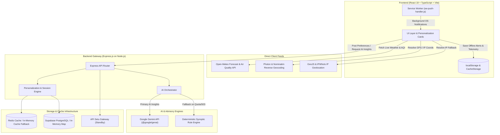

# System Architecture & Technical Design

> **Smart India Hackathon (SIH 2026) | Problem Statement: SIH26076**  
> **Ministry of Earth Sciences (MoES) / India Meteorological Department (IMD)**  
> **Project**: Mausam — Personalized Weather Homepage

---

## 1. System Design Overview

The **Mausam Personalized Weather Portal** is an offline-first, mobile-responsive Progressive Web App (PWA) and API gateway designed to transform raw meteorological data into actionable, persona-tailored decision support for Indian citizens.

### Problem Context & Purpose
Traditional weather portals present dense, generic synoptic feeds (isobars, radar grids, district lists) that force citizens to interpret how meteorological variables impact their daily routines. Mausam does **not** attempt to be a replacement numerical weather prediction (NWP) or forecasting engine; rather, it sits on top of standard meteorological observations and forecasts to dynamically personalize, prioritize, and translate weather conditions according to citizen personas (farmers, coastal fishermen, urban commuters, fitness runners, families, travelers, and event organizers).

### Core Architectural Principles
1. **Never Misrepresent Authority**: The application is an independent hackathon prototype (SIH 26076). It does not claim official IMD endorsement, authorship, or operational government deployment.
2. **Grounding & Zero Hallucination**: AI assistants and rule engines are strictly bound to verified atmospheric telemetry. No synthetic temperature or fake weather metrics are created.
3. **Graceful Multi-Tier Degradation**: Every component functions across three operational states:
   - **Live Telemetry**: Real-time Open-Meteo WMO surface observations & CPCB NAQI.
   - **Cached Offline Telemetry**: Stored in `localStorage` and Service Worker `CacheStorage` with explicit timestamp and `"CACHED OFFLINE"` attribution.
   - **Modeled Deterministic Fallback**: Algorithmic meteorological approximations for specialized domains (e.g., climatic soil moisture, coastal tidal surge models) explicitly labeled as models.

---

## 2. Architecture Diagram

```
┌────────────────────────────────────────────────────────────────────────────────────────┐
│                                 CITIZEN CLIENT (React 19 SPA / PWA)                     │
│                                                                                        │
│  ┌────────────────────────┐  ┌────────────────────────┐  ┌────────────────────────┐    │
│  │  Diurnal Visualizer    │  │  Dynamic Alert Banner  │  │   Personalized Cards   │    │
│  │  (Solar / Rain Canvas) │  │  (WMO/IMD Color Scheme)│  │  (Agriculture, Commute,│    │
│  └────────────────────────┘  └────────────────────────┘  │   Marine, Fitness, etc)│    │
│                                                          └────────────────────────┘    │
│                                                                                        │
│  ┌──────────────────────────────────────────────────────────────────────────────────┐  │
│  │ Local Client Stores: localStorage (Preferences & Cache) | Service Worker Cache  │  │
│  └──────────────────────────────────────────────────────────────────────────────────┘  │
└───────────────────────────┬────────────────────────────────────────────┬───────────────┘
                            │ (Direct Client-Side APIs)                  │ (/api/* requests)
                            ▼                                            ▼
┌──────────────────────────────────────────────┐  ┌──────────────────────────────────────┐
│          EXTERNAL CLIENT-SIDE APIS           │  │       EXPRESS.JS BACKEND GATEWAY     │
│                                              │  │              (Node.js / TS)          │
│ • Open-Meteo Forecast API (WMO Weather)      │  │                                      │
│ • Open-Meteo Air Quality API (CPCB NAQI)     │  │ • /api/ai/insight (Rate-limited)     │
│ • Open-Meteo Geocoding API (City Search)     │  │ • /api/ai/ask (Rate-limited)         │
│ • Komoot Photon (Reverse Geocoding)          │  │ • /api/preferences (User persistence)│
│ • OpenStreetMap Nominatim (GPS Fallback)     │  │ • /api/locations & /api/weather      │
│ • GeoJS / IPWhoIs (IP-based Geolocation)     │  │ • /api/healthcheck & /api/apisetu    │
└──────────────────────────────────────────────┘  └──────┬──────────────────────┬────────┘
                                                         │                      │
                                                         ▼                      ▼
┌──────────────────────────────────────────────┐  ┌──────────────────────────────────────┐
│           AI & PROTOCOL SERVICES             │  │        PERSISTENCE & CACHING         │
│                                              │  │                                      │
│ • Google Gemini SDK (@google/genai)          │  │ • Supabase PostgreSQL Client         │
│   (Models: 3.6 Flash, 3.8 Flash, Flash-Lite) │  │   (Fallback: In-Memory Map Store)    │
│ • Deterministic Synoptic Rule Engine         │  │ • Redis Cache (ioredis)              │
│   (Zero-latency zero-hallucination fallback) │  │   (Fallback: In-Memory Map Cache)    │
│ • API Setu Gateway (National Open APIs)      │  │                                      │
│   (Standby: Configurable via MeitY keys)     │  │                                      │
└──────────────────────────────────────────────┘  └──────────────────────────────────────┘
```

### Mermaid Diagram



---

## 3. Personalization Engine Implementation

The card prioritization logic is implemented in `frontend/src/engine/personalization.ts` and contextualized for Indian geography in `frontend/src/services/locationPersonalization.ts`.

### Scoring Mechanics (`calculatePersonalizedCardOrder`)
1. **Base User Preference Weighting**:
   - Primary selected interest cards receive an initial priority baseline (`+40` to `+60` points).
   - Secondary interests receive a moderate baseline (`+20` points).
2. **Atmospheric Threshold Triggers**:
   - **Severe Heat** (`temp > 38°C`): Prioritizes `health` (heatwave precautions) and `family` (child/elder hydration); penalizes midday `fitness`.
   - **Precipitation & Squalls** (`rainProbability > 60%` or condition contains rain/storm): Prioritizes `commute` (waterlogging warnings, alternate routes) and `agriculture` (fertilizer/irrigation guidance); deprioritizes `events` (open-air hazards).
   - **Severe Air Pollution** (`aqi > 200`): Escalates `health` to top card position with N95 mask / air purifier directives.
   - **Coastal Proximity**: Coastal locations (e.g., Mumbai, Chennai, Goa, Kochi, Visakhapatnam) activate `marine` card scoring (`seaCondition`, `waveHeight`, `windKnots`).
3. **Diurnal Phase Adjustments**:
   - **Morning (05:00 - 10:00)**: Boosts `fitness` (running windows) and `commute` (office ingress).
   - **Evening (16:30 - 20:00)**: Boosts `commute` (evening egress) and `family`.
   - **Night (20:00 - 05:00)**: Boosts `travel` and night temperature drops.

---

## 4. AI Agents & Intelligence Layer

The AI intelligence subsystem is located exclusively on the server in `backend/aiProvider.ts`.

### Architecture & Security Constraints
- **Zero Client Key Exposure**: The `@google/genai` client runs strictly on the Express backend (`backend/server.ts`). `GEMINI_API_KEY` is never prefixed with `VITE_` and is never sent to the client browser.
- **Cascading Fallback Orchestrator**: The `AIOrchestrator` manages a multi-tier fallback:
  1. `GeminiProvider`: Cascades across available candidate models (`gemini-3.6-flash` → `gemini-3.8-flash` → `gemini-3.1-flash-lite` → `gemini-flash-latest`).
  2. Circuit breaking: Detects quota exhaustion (`429`), server pressure (`503`), or cooldown delays (`retryDelay`) and switches automatically to the rule engine.
  3. `RuleEngineProvider`: 100% deterministic, zero-latency synoptic rules derived from standard meteorological tables.
- **Identity & Grounding Rules**:
  The system prompt introduces the assistant as:
  > *"You are Mausam AI, a prototype weather assistant for the Mausam personalized-homepage concept app (SIH26076), built using publicly available IMD/MoES-style weather data."*
  
  Strict prompting rules enforced:
  1. Do NOT invent fake weather metrics.
  2. Ground strictly on the supplied observation payload (`temperature`, `humidity`, `rainProbability`, `uvIndex`, `aqi`, `condition`).
  3. Respond in structured JSON (`summary` + `recommendation`).
  4. Make zero claims of official IMD authorship or government authority.

---

## 5. Data Flow & Source Provenance

### Live vs. Cached vs. Modeled Data Separation

| Data Point | Live Source | Cached State | Modeled Fallback |
| :--- | :--- | :--- | :--- |
| **Current Weather (Temp, Rain, Wind, UV)** | Open-Meteo WMO API (`api.open-meteo.com`) | `localStorage` (`mausam_live_${loc.id}`) with timestamp chip | Procedural sinusoidal generator based on Indian latitude/elevation |
| **Air Quality (AQI, PM2.5, PM10, NO2, SO2)** | Open-Meteo Air Quality API (`air-quality-api.open-meteo.com`) | Cached in `localStorage` | CPCB NAQI breakpoint formulas applied to seasonal baselines |
| **Severe Weather Warnings** | Dynamically synthesized from synoptic criteria | Service Worker `CacheStorage` | Regional threshold alerts |
| **Marine Tides & Swell** | *Planned: INCOIS Open Data* | Not applicable | **Modeled**: Coastal tidal model based on lunar cycle and coastal proximity |
| **Agricultural Soil Moisture** | *Planned: ISRO Bhuvan / ICAR* | Not applicable | **Modeled**: Climatic crop model (`humidity * 0.65 + rain adjustment`) |
| **Commute Traffic Delays** | *Planned: MoRTH / NHAI API Setu* | Not applicable | **Modeled**: Weather-induced transit delay model based on rain, fog, and road profile |
